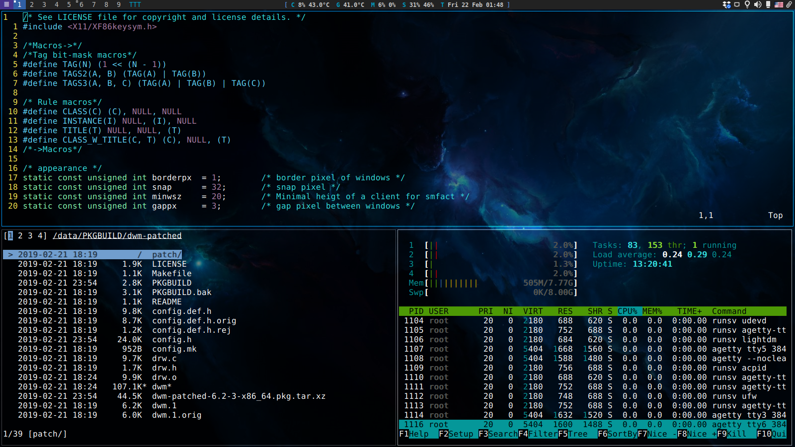

# my-arch-linux-configs-and-scripts : DWM
Patched DWM 6.2 for personal usage.

Installation
------------
To install dwm run "cd dwm-patched && sudo make clean install && sudo cp ../dwm.desktop /usr/share/xsessions/" or "cd dwm-patched && makepkg -sicf".

